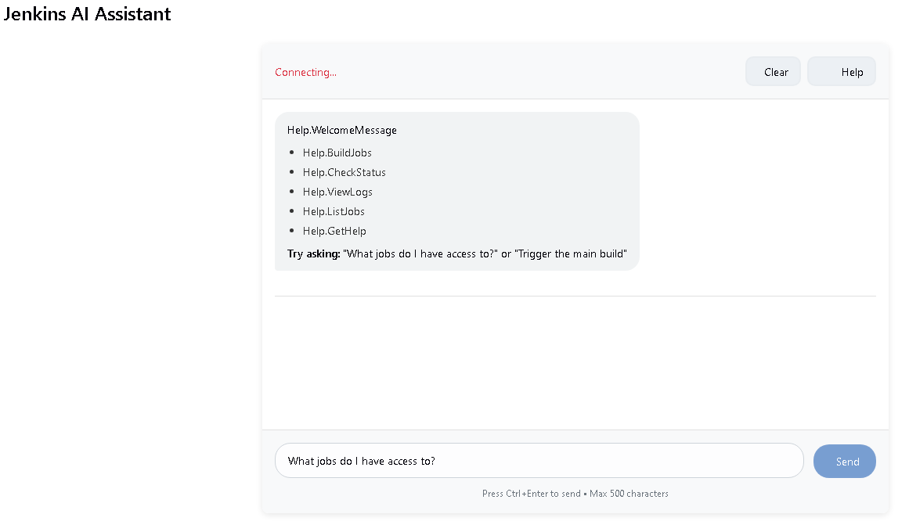
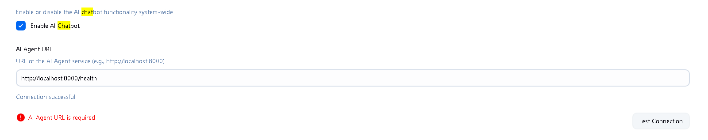
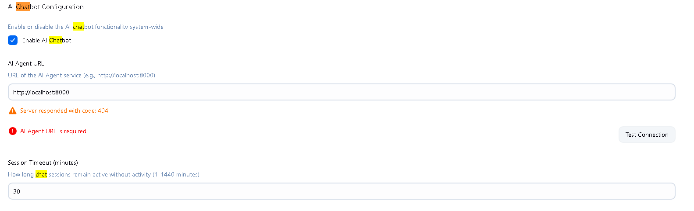

# Jenkins AI Chatbot Plugin

**AI-Powered Assistant for Jenkins Automation**

A Jenkins plugin that provides an intelligent conversational interface for Jenkins operations. Chat with AI to manage builds, deployments, and system operations through natural language, all while respecting your Jenkins permissions.

[](https://www.jenkins.io/)
[](https://openjdk.java.net/)
[](LICENSE)

## 🚀 Features

### 🤖 Natural Language Interface
- **Conversational AI**: Interact with Jenkins using plain English
- **Context Awareness**: AI understands your intent and maintains conversation context
- **Smart Suggestions**: Get helpful suggestions and guidance for Jenkins operations
- **Multi-turn Conversations**: Follow-up questions and complex workflows supported

### 🔐 Permission-Aware Security
- **Delegated Authorization**: AI respects your exact Jenkins permissions
- **Session Management**: Secure 15-minute sessions with automatic cleanup
- **Permission Validation**: Every action validated against user's actual permissions
- **Audit Trail**: All interactions logged for security and compliance

### 🛠️ Jenkins Operations
- **Build Management**: Trigger, monitor, and manage builds
- **Job Operations**: List, create, configure, and manage Jenkins jobs  
- **Log Access**: View build logs and console output
- **Status Monitoring**: Check build status and queue information
- **Pipeline Support**: Work with Jenkins pipelines and multi-stage builds

### 💬 Rich User Interface
- **Modern Chat Interface**: Clean, responsive design integrated with Jenkins UI
- **Real-time Communication**: WebSocket and REST API support
- **Error Handling**: Clear error messages and graceful degradation
- **Mobile Responsive**: Works on desktop, tablet, and mobile devices

## 📦 Installation

### Prerequisites
- **Jenkins**: Version 2.462.3 or later
- **Java**: OpenJDK 11 or later
- **AI Agent Service**: Running instance (see [ai-agent/README.md](../ai-agent/README.md))

### Method 1: Manual Installation

1. **Download Plugin**
   ```bash
   # Build from source
   cd jenkins-plugin
   mvn clean package
   
   # Or download pre-built HPI file
   wget https://github.com/your-org/jenkins-chatbot/releases/latest/download/jenkins-chatbot.hpi
   ```

2. **Install in Jenkins**
   - Navigate to **Manage Jenkins → Manage Plugins**
   - Go to **Advanced** tab
   - Under **Upload Plugin**, choose `jenkins-chatbot.hpi`
   - Click **Upload** and restart Jenkins when prompted

3. **Verify Installation**
   - After restart, check **Installed Plugins** for "Jenkins AI Chatbot Plugin"
   - Look for "AI Assistant" link in Jenkins sidebar (if you have permissions)

### Method 2: Jenkins Update Center (Future)

```bash
# When available in Jenkins Update Center
# Go to Manage Jenkins → Manage Plugins → Available
# Search for "AI Chatbot" and install
```

### Method 3: Configuration as Code (JCasC)

```yaml
# jenkins.yaml
unclassified:
  chatbotGlobalConfiguration:
    enableChatbot: true
    aiAgentUrl: "http://localhost:8000"
    sessionTimeoutMinutes: 15
    debugMode: false
```

## ⚙️ Configuration

### Global Configuration

1. **Navigate to Settings**
   - Go to **Manage Jenkins → Configure System**
   - Scroll to **AI Chatbot Configuration** section

2. **Configure AI Service**
   ```
   AI Agent URL: http://localhost:8000
   Enable AI Chatbot: ✓ Checked
   Session Timeout: 15 minutes (recommended)
   Debug Mode: ☐ Unchecked (enable for troubleshooting)
   ```

3. **Test Connection**
   - Click **Test Connection** to verify AI Agent service is reachable
   - Should show "Connection successful" if properly configured

### User Permissions

The plugin introduces a new permission: **AI Chatbot → Use**

**Grant Permission**:
```
Manage Jenkins → Configure Global Security → Authorization
- Assign "AI Chatbot/Use" permission to appropriate users/groups
- Recommended: Grant to same users who have Job/Read permissions
```

**Permission Matrix**:
| User Action | Required Jenkins Permissions |
|-------------|------------------------------|
| Access AI Assistant | AI Chatbot/Use + Overall/Read |
| Trigger Builds | AI Chatbot/Use + Job/Build |
| View Build Logs | AI Chatbot/Use + Job/Read |
| Create Jobs | AI Chatbot/Use + Job/Create |
| Configure Jobs | AI Chatbot/Use + Job/Configure |
| Delete Jobs | AI Chatbot/Use + Job/Delete |

### Environment Variables (Optional)

```bash
# Override default configuration via environment
JENKINS_CHATBOT_URL=http://ai-agent:8000
JENKINS_CHATBOT_TIMEOUT=30
JENKINS_CHATBOT_DEBUG=false
```

## 🎯 Usage

### Accessing the AI Assistant

1. **Sidebar Access**
   - Look for "AI Assistant" in the Jenkins main sidebar
   - Click to open the chat interface

2. **Direct URL**
   ```
   http://your-jenkins-url/ai-assistant/
   ```

### Chat Interface



**Interface Elements**:
- **Chat Messages**: Conversation history with user and AI messages
- **Input Field**: Type your questions and commands (max 500 characters)
- **Send Button**: Submit your message (or press Ctrl+Enter)
- **Clear Button**: Clear conversation history
- **Help Button**: Get usage help and examples
- **Connection Status**: Shows connection state to AI service

### Example Interactions

**Triggering Builds**:
```
You: "Trigger the frontend build"
AI: "I'll trigger the frontend build for you. Let me start the build now."
[Build triggered successfully]

You: "Build the deploy pipeline with environment=staging"
AI: "Starting the deploy pipeline with staging environment parameter."
```

**Checking Status**:
```
You: "What's the status of my latest build?"
AI: "Your latest build #47 for the frontend project completed successfully 5 minutes ago."

You: "Show me recent failed builds"
AI: "Here are your recent failed builds:
• backend-service #23 - Failed 2 hours ago
• integration-tests #15 - Failed yesterday"
```

**Viewing Logs**:
```
You: "Show me the log for build #45"
AI: "Here are the recent log entries for build #45:
[09:15:23] Starting build...
[09:15:45] Tests passed: 127/127
[09:16:02] Build completed successfully"
```

**Getting Help**:
```
You: "What can you help me with?"
AI: "I can help you with:
• Trigger builds and deployments
• Check build status and history
• View build logs and console output
• List your accessible jobs
• Get help with Jenkins operations

Try asking me something specific like 'trigger the main build' or 'show me recent builds'."
```

### Voice Commands (Future Feature)

```
"Hey Jenkins, trigger the production build"
"What's the status of the deployment pipeline?"
"Show me the logs for the latest failed build"
```

## 🏗️ Architecture

### Plugin Components

```
Jenkins Plugin Architecture:
├── ChatbotRootAction      # Main entry point, sidebar integration
├── ChatbotPlugin         # Plugin lifecycle and permissions
├── ChatApiHandler        # REST API endpoints
├── ChatSessionManager    # Session lifecycle management
├── SecurityManager       # Permission validation
├── AIAgentClient        # HTTP client for AI service
├── ChatbotGlobalConfiguration # System-wide settings
└── UI Components         # Jelly templates, CSS, JavaScript
```

### Communication Flow

```
User Browser → Jenkins Plugin → AI Agent Service → Google Gemini
     ↓              ↓                ↓
Chat Interface → Session Mgmt → 21 MCP Tools → Jenkins API
     ↓              ↓                ↓
 WebSocket/REST → Permission → Tool Execution → Build Actions
```

### Session Management

**Session Lifecycle**:
1. User accesses AI Assistant
2. Plugin creates secure session with 15-minute expiry
3. Session token format: `jenkins_token_{userId}_{sessionId}_{expiry}`
4. All AI requests include user context and permissions
5. Sessions automatically cleaned up on expiry

**Security Model**:
- **Delegated Permissions**: AI acts with user's exact Jenkins permissions
- **Token-Based Auth**: Time-limited tokens with automatic expiry
- **Permission Validation**: Every action validated before execution
- **Audit Logging**: All interactions logged for security compliance

## 🔌 API Reference

### REST Endpoints

The plugin provides REST API endpoints for programmatic access:

#### POST `/ai-assistant/api`
**Create Session & Send Message**

**Request**:
```json
{
  "message": "What jobs do I have access to?",
  "session_id": "optional-existing-session-id",
  "user_token": "optional-jenkins-api-token"
}
```

**Response**:
```json
{
  "response": "You have access to 5 jobs: frontend, backend, deploy, testing, and maintenance.",
  "actions": [
    {
      "type": "jenkins_api_call",
      "endpoint": "/api/json",
      "method": "GET",
      "description": "List accessible jobs"
    }
  ],
  "sessionState": {
    "sessionId": "550e8400-e29b-41d4-a716-446655440000",
    "userId": "john_doe",
    "lastActivity": 1640995200000
  },
  "timestamp": 1640995200000
}
```

#### GET `/ai-assistant/health`
**Health Check**

**Response**:
```json
{
  "status": "healthy",
  "aiAgentConnected": true,
  "timestamp": 1640995200000
}
```

### WebSocket Endpoint

```javascript
// Connect to WebSocket (future feature)
const ws = new WebSocket('ws://jenkins-url/ai-assistant/chatWebSocket');
ws.onmessage = function(event) {
    const response = JSON.parse(event.data);
    console.log('AI Response:', response);
};
```

### Data Models

**ChatRequest**:
```json
{
  "message": "string (required)",
  "session_id": "string (optional)", 
  "user_token": "string (optional)",
  "context": "object (optional)"
}
```

**ChatResponse**:
```json
{
  "response": "string (required)",
  "actions": "array (optional)",
  "sessionState": "object (optional)",
  "timestamp": "number (required)"
}
```

## 🛡️ Security

### Permission Model

**Plugin Permissions**:
- **AI Chatbot/Use**: Basic access to chat interface
- Inherits all standard Jenkins permissions for actual operations

**Security Features**:
- **Session-based Authentication**: 15-minute session tokens
- **Permission Inheritance**: AI respects user's Jenkins permissions exactly
- **CSRF Protection**: Automatic Jenkins CSRF token handling
- **Input Validation**: All user inputs validated and sanitized
- **Rate Limiting**: Protection against abuse (future feature)

### Security Best Practices

**For Administrators**:
```yaml
# Recommended security configuration
security:
  permissions:
    ai-chatbot-use: "authenticated-users"  # Grant to authenticated users only
    ai-chatbot-admin: "jenkins-admins"     # Admin permissions for system managers
```

**For Users**:
- Use strong Jenkins authentication (LDAP, SAML, etc.)
- Keep sessions secure and log out when finished  
- Report any suspicious AI responses to administrators
- Don't share session tokens or credentials

### Audit and Compliance

**Audit Logging**:
- All chat interactions logged with user context
- Failed permission checks recorded
- AI service communication logged
- Session creation and expiry tracked

**Log Locations**:
```bash
# Jenkins plugin logs
$JENKINS_HOME/logs/jenkins.log

# Search for chatbot events
grep "ChatbotPlugin\|ChatSessionManager\|AIAgentClient" jenkins.log
```

## 🔍 Troubleshooting

### Common Issues

#### 1. "AI Assistant" not visible in sidebar
**Cause**: User lacks required permissions
**Solution**:
```
1. Check user has "AI Chatbot/Use" permission
2. Verify user has "Overall/Read" permission  
3. Confirm plugin is installed and enabled
4. Check Jenkins logs for permission errors
```

#### 2. Connection failed to AI service
**Cause**: AI Agent service not running or misconfigured
**Solution**:
```
1. Verify AI Agent service is running on configured URL
2. Test connection: curl http://ai-agent-url:8000/health
3. Check firewall and network connectivity
4. Verify AI Agent URL in Jenkins configuration
```

#### 3. Chat messages not sending
**Cause**: JavaScript errors or CSRF token issues
**Solution**:
```
1. Open browser developer console for errors
2. Refresh page to get new CSRF token
3. Clear browser cache and cookies
4. Try different browser
```

#### 4. Permission denied errors
**Cause**: User lacks required Jenkins permissions for requested action
**Solution**:
```
1. Check user permissions in Jenkins security settings
2. Verify user has permissions for specific Jenkins operations
3. Review audit logs for permission validation failures
4. Contact Jenkins administrator to grant required permissions
```

#### 5. Session expired frequently
**Cause**: Short session timeout or inactive sessions
**Solution**:
```
1. Increase session timeout in plugin configuration
2. Stay active in chat interface
3. Check for system clock synchronization issues
4. Review session cleanup logs
```

### Debug Mode

**Enable Debug Logging**:
1. Go to **Manage Jenkins → Configure System**
2. Check **Debug Mode** in AI Chatbot Configuration
3. Save configuration

**Debug Information**:
```bash
# Debug logs include:
# - Detailed session management
# - AI service communication
# - Permission validation steps  
# - WebSocket connection details
# - Request/response payloads
```

### Log Analysis

**Useful Log Patterns**:
```bash
# Session creation
grep "ChatSessionManager.*created" jenkins.log

# Permission failures  
grep "SecurityManager.*denied" jenkins.log

# AI service communication
grep "AIAgentClient" jenkins.log

# Plugin lifecycle
grep "ChatbotPlugin.*start\|stop" jenkins.log
```

## 🧪 Development

### Building from Source

**Prerequisites**:
- Java 11+
- Maven 3.6+
- Jenkins development environment

**Build Steps**:
```bash
# Clone repository
git clone https://github.com/your-org/jenkins-chatbot-plugin.git
cd jenkins-chatbot-plugin/jenkins-plugin

# Build plugin
mvn clean compile

# Run tests
mvn test

# Package plugin
mvn package

# Generated files:
# target/jenkins-chatbot.hpi (installable plugin)
# target/jenkins-chatbot.jar (JAR file)
```

### Development Environment

**Setup Local Jenkins**:
```bash
# Download Jenkins WAR
wget https://get.jenkins.io/war-stable/latest/jenkins.war

# Run Jenkins with plugin
mvn hpi:run

# Access development Jenkins
# http://localhost:8080/jenkins
```

**Hot Reload Development**:
```bash
# Enable hot reload during development
mvn hpi:run -Djetty.port=8090 -Djenkins.httpPort=8090
```

### Testing

**Unit Tests**:
```bash
# Run unit tests
mvn test

# Run specific test class
mvn test -Dtest=ChatSessionManagerTest

# Generate test coverage report
mvn jacoco:report
```

**Integration Tests**:
```bash
# Run integration tests with test harness
mvn verify -Pit

# Test with different Jenkins versions
mvn test -Djenkins.version=2.462.3
```

**Manual Testing**:
```bash
# Start test environment
docker-compose up -d  # Start AI Agent service
mvn hpi:run          # Start Jenkins with plugin

# Test scenarios:
# 1. Install plugin in clean Jenkins
# 2. Configure AI Agent URL
# 3. Grant permissions to test user  
# 4. Access chat interface
# 5. Test basic operations
```

### Plugin Structure

```
src/main/java/io/jenkins/plugins/chatbot/
├── ChatbotPlugin.java              # Main plugin class
├── ChatbotRootAction.java          # Sidebar integration  
├── ChatbotGlobalConfiguration.java # System configuration
├── ChatApiHandler.java             # REST API endpoints
├── ChatSessionManager.java         # Session management
├── SecurityManager.java            # Security & permissions
├── AIAgentClient.java              # AI service client
└── ChatWebSocketHandler.java       # WebSocket support

src/main/resources/
├── index.jelly                     # Plugin description
└── io/jenkins/plugins/chatbot/
    ├── Messages.properties          # Internationalization
    ├── ChatbotPlugin/
    │   └── chat-interface.jelly     # Main UI template
    └── ChatbotGlobalConfiguration/
        └── config.jelly             # Configuration form

src/main/webapp/
└── chat-interface.js               # Client-side JavaScript
```

### Contributing

**Code Standards**:
- Follow Jenkins plugin development guidelines
- Use Java 11 language features appropriately
- Include comprehensive JavaDoc for public APIs
- Write unit tests for new functionality
- Follow Jenkins UI/UX patterns for consistency

**Pull Request Process**:
1. Fork repository and create feature branch
2. Implement changes with tests
3. Update documentation as needed
4. Test with multiple Jenkins versions
5. Submit pull request with detailed description

**Development Resources**:
- [Jenkins Plugin Tutorial](https://www.jenkins.io/doc/developer/tutorial/)
- [Plugin Development Guide](https://www.jenkins.io/doc/developer/)
- [UI/UX Guidelines](https://www.jenkins.io/doc/developer/views/)

## 📸 Screenshots

### Configuration Screen


### Global Settings  


### Chat Interface


## 🔗 Related Projects

- **[AI Agent Service](../ai-agent/README.md)**: Backend AI service with 21 MCP tools
- **[Project Documentation](../docs/)**: Implementation guides and technical details
- **[Testing Scripts](../scripts/)**: Automated testing and validation tools

## 📄 License

This project is licensed under the MIT License - see the [LICENSE](LICENSE) file for details.

## 🤝 Support

**Getting Help**:
- **Issues**: [GitHub Issues](https://github.com/your-org/jenkins-chatbot-plugin/issues)
- **Discussions**: [GitHub Discussions](https://github.com/your-org/jenkins-chatbot-plugin/discussions)  
- **Documentation**: Check the `docs/` directory for detailed guides

**Bug Reports**:
Please include:
- Jenkins version
- Plugin version
- Java version
- AI Agent service version
- Steps to reproduce the issue
- Relevant log excerpts

**Feature Requests**:
- Describe the use case and expected behavior
- Include examples of how you'd like to use the feature
- Consider contributing the implementation

---

**Built for Jenkins**: Compatible with Jenkins 2.462.3+ | **Java 11+** | **Modern UI Design**